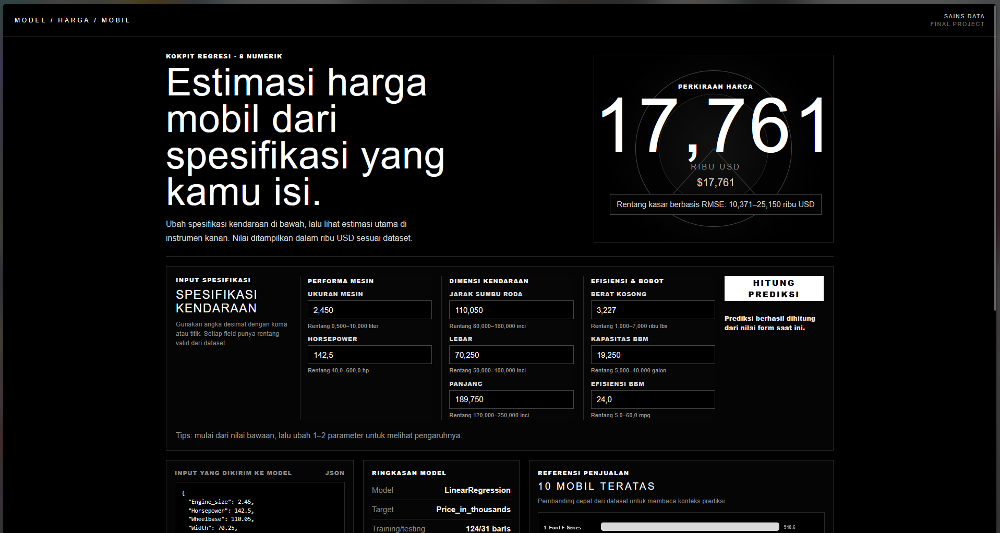
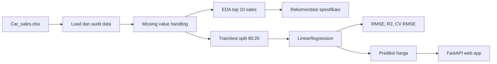

<div align="center">

# Car price prediction data science

Prediksi harga mobil berbasis dataset `Car_sales.xlsx` dengan alur CRISP-DM, model `LinearRegression`, notebook Google Colab, dan web app FastAPI.

[](https://www.python.org/)
[](https://scikit-learn.org/)
[](https://fastapi.tiangolo.com/)
[](https://github.com/feb027/car-price-prediction-ds/actions/workflows/ci.yml)

[Google Colab](https://colab.research.google.com/github/feb027/car-price-prediction-ds/blob/main/notebooks/car_price_prediction_crispdm.ipynb) · [Live web app](https://car-ds.aquarise.my.id/) · [Notebook](notebooks/car_price_prediction_crispdm.ipynb) · [Dataset](data/raw/Car_sales.xlsx)

</div>

---

## Ringkasan

Project ini dibuat untuk tugas akhir mata kuliah Sains Data. Dataset yang digunakan berisi data penjualan mobil, harga, dan spesifikasi teknis. Dari data tersebut saya membuat analisis top 10 mobil dengan penjualan tertinggi, rekomendasi spesifikasi berbasis median top sales, serta model prediksi harga mobil menggunakan `LinearRegression`.

Output utama project:

- notebook Google Colab yang bisa dijalankan dari awal sampai akhir,
- model baseline `LinearRegression` dengan split train/test 80:20,
- evaluasi RMSE, R2 Score, cross-validation, dan scatter plot actual vs predicted,
- web app sederhana untuk mencoba prediksi harga dari input spesifikasi mobil.

## Preview web app



## Alur project



## Hasil utama

| Bagian | Hasil |
| --- | --- |
| Dataset | 157 baris, 16 kolom |
| Target | `Price_in_thousands` |
| Model | `LinearRegression` |
| Fitur final | 8 fitur numerik spesifikasi mobil |
| Split | 80% training, 20% testing |
| RMSE test | 7.389 ribu USD |
| R2 Score test | 0.746 |
| CV RMSE mean | 7.134 ribu USD |
| Web app | <https://car-ds.aquarise.my.id/> |

`Power_perf_factor` diaudit tetapi tidak digunakan pada model final karena terlalu dekat dengan harga dan membuat evaluasi terlihat hampir sempurna pada dataset kecil.

## Struktur repo

```text
car-price-prediction-ds/
├── api/                  # Backend FastAPI
├── assets/screenshots/   # Folder screenshot untuk README
├── data/raw/             # Dataset asli
├── deploy/               # Script deployment VPS
├── notebooks/            # Notebook final Google Colab
├── scripts/              # Script validasi dan smoke test
├── src/                  # Preprocessing, modeling, visualisasi
├── tests/                # Test pipeline dan API
└── web/                  # Frontend HTML/CSS/JS
```

## Jalankan notebook di Google Colab

Buka link berikut:

[https://colab.research.google.com/github/feb027/car-price-prediction-ds/blob/main/notebooks/car_price_prediction_crispdm.ipynb](https://colab.research.google.com/github/feb027/car-price-prediction-ds/blob/main/notebooks/car_price_prediction_crispdm.ipynb)

Di Colab, jalankan:

1. `Runtime` → `Run all`
2. tunggu semua cell selesai,
3. cek bagian evaluasi dan prediksi harga di akhir notebook.

Notebook memakai path relatif dan fallback upload file, jadi tetap bisa dijalankan jika dataset belum terbaca otomatis.

## Jalankan web app lokal

```bash
git clone https://github.com/feb027/car-price-prediction-ds.git
cd car-price-prediction-ds
python3 -m venv .venv
source .venv/bin/activate
pip install -r requirements.txt
uvicorn api.main:app --host 127.0.0.1 --port 8516
```

Buka:

```text
http://127.0.0.1:8516/
```

Health check:

```bash
curl http://127.0.0.1:8516/api/health
```

Expected output:

```json
{"status":"ok"}
```

## API singkat

| Method | Endpoint | Fungsi |
| --- | --- | --- |
| `GET` | `/` | halaman web prediksi |
| `GET` | `/api/health` | cek status backend |
| `GET` | `/api/metadata` | metadata fitur, model, dan top sales |
| `POST` | `/api/predict` | prediksi harga dari spesifikasi mobil |

Contoh request prediksi:

```bash
curl -X POST http://127.0.0.1:8516/api/predict \
  -H "Content-Type: application/json" \
  -d '{
    "Engine_size": 2.4,
    "Horsepower": 180,
    "Wheelbase": 108,
    "Width": 70,
    "Length": 190,
    "Curb_weight": 3.2,
    "Fuel_capacity": 17,
    "Fuel_efficiency": 28
  }'
```

## Validasi

```bash
python3 scripts/validate_dataset.py
python3 scripts/smoke_app_pipeline.py
python3 -m pytest -q
```

Validasi terakhir:

```text
9 passed
```

## Deployment

Aplikasi publik berjalan di:

```text
https://car-ds.aquarise.my.id/
```

Untuk VPS dengan Caddy, contoh konfigurasi ada di `deploy/Caddyfile.example`.

## Batasan

- Dataset hanya 157 baris, sehingga hasil belum bisa dianggap sebagai model produksi.
- Model linear tidak selalu menangkap hubungan harga yang kompleks.
- Fitur seperti kondisi mobil, tahun produksi detail, varian trim, dan tren pasar terbaru tidak tersedia di dataset.
- Rentang prediksi berbasis RMSE hanya estimasi kasar, bukan interval statistik formal.

## Identitas

| Field | Isi |
| --- | --- |
| Nama | Febnawan Fatur Rochman |
| NPM | 237006029 |
| Kelas | Informatika A |
| Mata kuliah | Sains Data |
